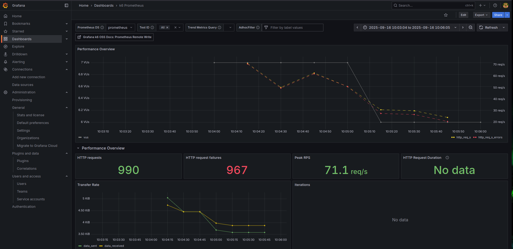

### О проекте

Каким бы классным не был K6, но когда нужно протестить сразу много - то беда.
Проект призван снять лишнюю нагрузку, дабы не собирать ручками скрипты под каждый тестируемый сервис.


### Подготовка

Заполняем vars (inventory.yaml):
```bash
cp -r inventory/example inventory/project 
```

Необходимо закинуть все тестируемые сервисы.
После заполнения выполнить:
```bash
ansible-playbook -i inventory/project/inventory.yaml playbook.yml
```

Ансибл положит в текущий каталог два сгенерированных компоуза.


### Генерация скриптов

Собираем образ для генирации:
```bash
docker build -t generator:2.23.3 -f docker/generator .
```

Запускаем генерацию:
```bash
docker compose -f generate.docker-compose.yml
```
В каталоге `k6` будут лежать сгенерированные скрипты.
В каждом каталоге будет лежать `.env.example`.
Его необходимо скопировать в `.env` и заполнить.


### Запуск дашборда

Перед запуском тестов необходимо поднять Prometheus, как получателя метрик тестирования:
```bash
mkdir -p data/{prometheus,grafana}
sudo chown 65534:65534 data/prometheus
sudo chown 472:472 data/grafana
docker compose up -d
```
В графане настроить источник данных Prometheus:

url: `http://prometheus:9090`

И импортировать dashboard: `19665`

### Запуск тестирования

```bash
docker compose -f run-test.docker-compose.yml up 
```

Во время тестирования скорее всего пойдут ошибки.
Генератор чувствителен к используемой нотации переменных. Расхождение между снейком и верблюдом придется править руками.
Если в api есть загрузка файлов, то, скорее всего, придется фиксить руками: переносить из функции открытие файла на верх, 
оставив внутри функции переменную.
Файлики подкладываем в `data` внутри каталога сервиса.
По сути необходимо фиксить до тех пор, пока не будет 100% успешно проведенный тест на 1 пользователе и 1 итерации.
До тех пор будет не правдоподобная нагрузка.


### Результат
И когда все предыдущие этапы прошли успешно - можем наблюдать следующую картину:

На красноту скрина пока внимание не обращем. Фактическое тестирование проводилось, но тут только тестовые запуски без заполнения env'ов

